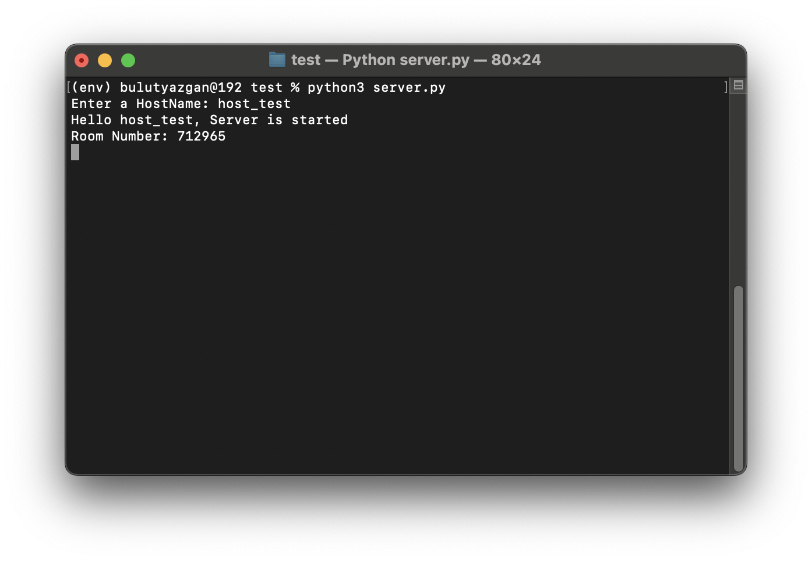
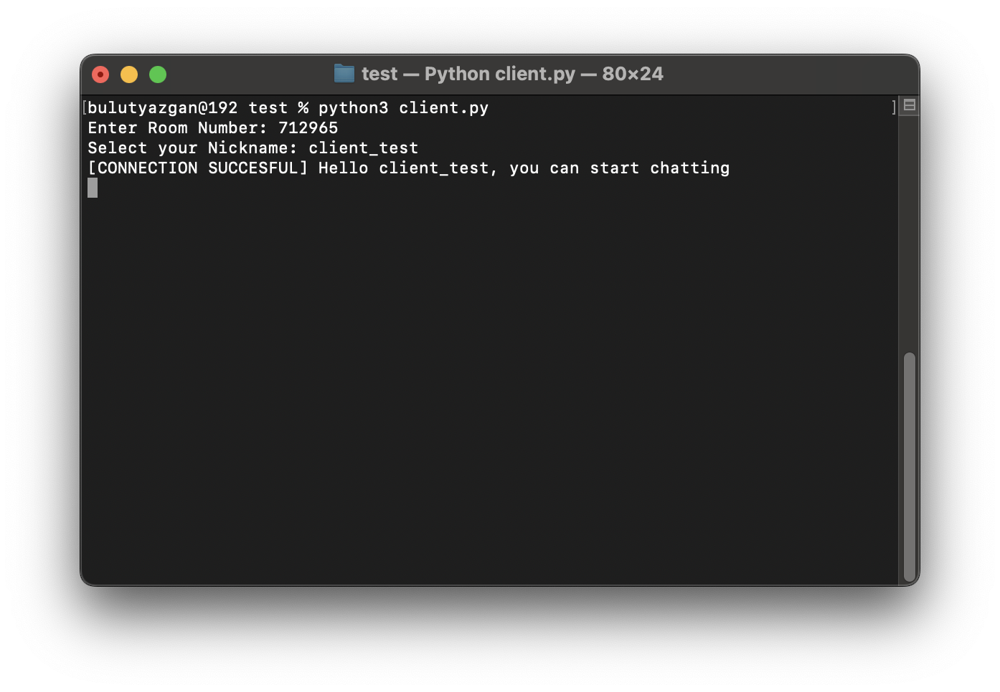

# RoomConnect: Simplified Multiplayer Connections Without Port Forwarding

RoomConnect is a proof-of-concept chatroom app designed to simplify network connections for developers. By leveraging ngrok's dynamic URLs and stripping them down into room numbers, it eliminates the need for port forwarding, making it easier to establish multiplayer connections over the internet.

## What This Project Does
This project converts ngrok-generated URLs into simplified room numbers, allowing clients to connect using these numbers. It mimics a common approach in multiplayer games, making it easier for developers to implement internet-based connections without the hassle of configuring port forwarding.

Currently, the project functions as a basic chatroom but demonstrates the potential to be integrated into more complex systems, such as multiplayer games built with frameworks like Pygame.

## Features
- Converts dynamic ngrok URLs into room numbers for easy sharing.
- Eliminates the need for port forwarding.
- Serves as a foundation for integrating multiplayer functionalities into games or other network-based applications.

## Setup
1. Clone the repository:
   ```bash
   git clone https://github.com/siryazgan/RoomConnect
   cd RoomConnect
   ```
2. Install the required dependencies by running:
   ```bash
   pip install -r requirements.txt
   ```
3. Run the server and client scripts to start the chatroom. (The server will ask for your ngrok auth-token the first time you run it, and save it to a file named `.ngrok_token.txt`)

## Example Usage
Below are some screenshots demonstrating the application in action:




## Possible Errors and Troubleshooting
- **Region-Specific Issues:** The connection assumes that your ngrok URL uses the "eu" prefix. If you are outside the EU or if ngrok generates a URL with a different format, you may need to modify the link handling in the code.
- **Other Issues:** Ensure that your ngrok token is valid and that all dependencies are installed correctly.

## Future Plans
If there is interest, I plan to:
- Expand the project for better integration with game development frameworks like Pygame.
- Add features such as dynamic room creation and more robust error handling.
- Explore additional use cases for the room number functionality.

## Feedback
I am open to feedback and suggestions! Feel free to raise issues or contribute via pull requests on the [GitHub repository](https://github.com/siryazgan/RoomConnect).
