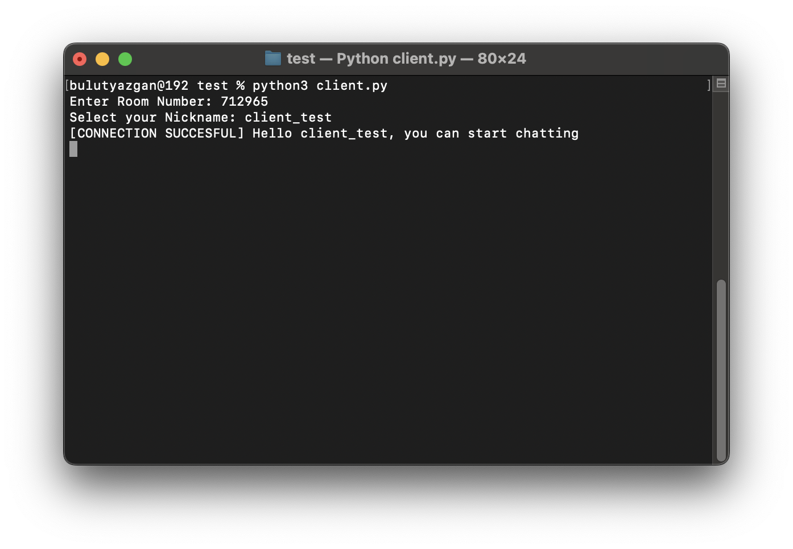

# RoomConnect: Simplified Multiplayer Connections Without Port Forwarding

RoomConnect is a proof-of-concept chatroom app designed to simplify network connections for developers. By leveraging ngrok's dynamic URLs and stripping them down into room numbers, it eliminates the need for port forwarding, making it easier to establish multiplayer connections over the internet.

## What This Project Does
This project converts ngrok-generated URLs into simplified room numbers, allowing clients to connect using these numbers. It mimics a common approach in multiplayer games, making it easier for developers to implement internet-based connections without the hassle of configuring port forwarding.

Currently, the project functions as a basic chatroom but demonstrates the potential to be integrated into more complex systems, such as multiplayer games built with frameworks like Pygame.

## Features
- Converts dynamic ngrok URLs into room numbers for easy sharing.
- Eliminates the need for port forwarding.
- Serves as a foundation for integrating multiplayer functionalities into games or other network-based applications.

## Setup
1. Clone the repository:
   ```bash
   git clone https://github.com/siryazgan/RoomConnect
   cd RoomConnect
   ```
2. Install the required dependencies by running:
   ```bash
   pip install -r requirements.txt
   ```
3. Run the server and client scripts to start the chatroom. (The server will ask for your ngrok auth-token the first time you run it, and save it to a file named `.ngrok_token.txt`)

## Example Usage
Below are some screenshots demonstrating the algorithm's basics in action:




## Possible Errors and Troubleshooting
- **Region-Specific Issues:** The connection assumes that your ngrok URL uses the "eu" prefix. If you are outside the EU or if ngrok generates a URL with a different format, you may need to modify the link handling in the code.
- **Other Issues:** Ensure that your ngrok token is valid and that all dependencies are installed correctly.

## Feedback
I am open to feedback and suggestions! Feel free to raise issues or contribute.

# RoomConnect 🎮

Make your Pygame games multiplayer! Like playing with friends over the internet.

## How to Start 🚀

1. Install the thing you need:
```bash
pip install pyngrok
```

2. Add RoomConnect to your game:
```python
from RoomConnect import RoomConnect
network = RoomConnect()
```

## How it Works 📝

Think of it like passing notes in class:
- One player is the "host" (like the teacher)
- Other players can "join" using a special room number
- Players send messages to tell others what they did

### Messages are like Notes 📨

Messages look like this:
```python
# In a game of Tic-Tac-Toe:
{
    'type': 'move',         # What kind of message
    'data': {              # What happened
        'position': (1, 1),  # Where they clicked
        'symbol': 'X'        # What to draw
    },
    'sender': 'Player1'    # Who sent it
}
```

## Making Your Game Multiplayer 🎯

1. Start the game:
```python
network = RoomConnect()
network.set_token("your_ngrok_token")  # Only needed once!

# To be the host:
room_number = network.host_game("YourName")
print(f"Tell your friend this number: {room_number}")

# To join a friend's game:
network.join_game(room_number, "YourName")
```

2. Tell RoomConnect what messages to expect:
```python
network.register_message_type("move")
network.register_message_type("chat")
```

3. Send things that happen in your game:
```python
# When player makes a move:
network.send_game_data("move", {
    "x": 100,
    "y": 200
})
```

4. Check for messages from other players:
```python
# In your game loop:
messages = network.get_messages()
if messages:
    for msg in messages:
        if msg['type'] == "move":
            # Do something with msg['data']
```

## Important Functions 🛠️

- `host_game(nickname)` - Start a new game
- `join_game(room_number, nickname)` - Join someone's game
- `register_message_type(type)` - Tell what messages to expect
- `send_game_data(type, data)` - Send something to other players
- `get_messages()` - Get messages from other players

That's it! Now you can make any game multiplayer! 🌟
